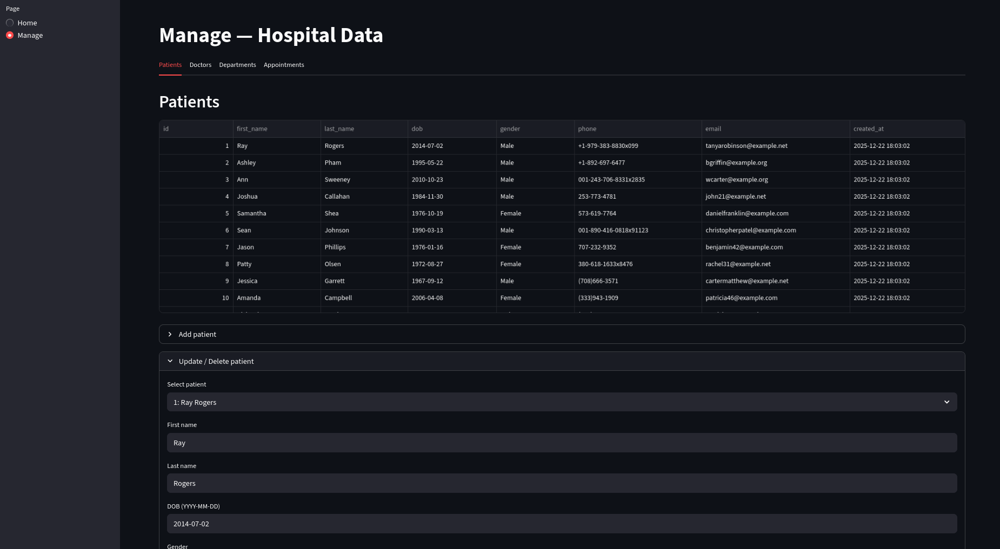

# Hospital Management System - Database Documentation

**Bilal Al Tabbaa** 123200013  
**Omar Assassi** 123200023

---

## System Overview

The Hospital Management System manages patient care through four core components: patient records, hospital departments, doctor assignments, and appointment scheduling. Built with SQLite, Python, and Streamlit, it provides an efficient interface for hospital operations.

---

## Business Rules and Constraints

### Business Rules
1. **Patients**: Must have first and last name; optional fields include dob, gender, phone, email
2. **Departments**: Unique names required; can exist without doctors (e.g., Cardiology, Neurology)
3. **Doctors**: Must have first and last name; optionally assigned to one department
4. **Appointments**: Require patient_id and start_time; doctor and department are optional; default status is 'scheduled'
5. **Integrity**: All foreign key constraints enforced via `PRAGMA foreign_keys = ON`

### Constraints
- **Referential**: All foreign keys must reference valid IDs in parent tables
- **Unique**: Department names and all primary keys
- **Not Null**: Patient/doctor names, appointment patient_id and start_time
- **Defaults**: created_at timestamps, appointment status='scheduled'

---

<div style="page-break-after: always;"></div>

## Database Tables

| Table | Primary Key | Foreign Keys | Key Attributes |
|-------|-------------|--------------|----------------|
| **patients** | id | - | first_name*, last_name*, dob, gender, phone, email |
| **departments** | id | - | name* (UNIQUE) |
| **doctors** | id | department_id → departments(id) | first_name*, last_name*, email |
| **appointments** | id | patient_id* → patients(id)<br>doctor_id → doctors(id)<br>department_id → departments(id) | start_time*, end_time, status, reason |

*Required fields

<div style="page-break-after: always;"></div>

## ER Diagram

```
┌─────────────────┐
│   departments   │
│─────────────────│
│ PK: id          │
│    name (U)     │
│    created_at   │
└────────┬────────┘
         │ 1
         │
         │ N
    ┌────┴────────┐
┌───▼──────────┐  │
│   doctors    │  │
│──────────────│  │
│ PK: id       │  │
│    first_name│  │
│    last_name │  │
│ FK: dept_id  │  │
│    email     │  │
│    created_at│  │
└───┬──────────┘  │
    │ 1           │
    │             │
    │ N           │ N
┌───▼─────────────▼────────┐         ┌─────────────────┐
│     appointments         │    N    │    patients     │
│──────────────────────────│◄────────┤─────────────────│
│ PK: id                   │    1    │ PK: id          │
│ FK: patient_id    (NN)   │         │    first_name   │
│ FK: doctor_id            │         │    last_name    │
│ FK: department_id        │         │    dob          │
│    start_time     (NN)   │         │    gender       │
│    end_time              │         │    phone        │
│    status                │         │    email        │
│    reason                │         │    created_at   │
│    created_at            │         └─────────────────┘
└──────────────────────────┘

Legend:
  PK  = Primary Key
  FK  = Foreign Key
  U   = Unique Constraint
  NN  = Not Null
  1   = One (cardinality)
  N   = Many (cardinality)
  ◄── = Relationship line
```

<div style="page-break-after: always;"></div>

### Relationships

1. **departments → doctors** (1:N) - One department has many doctors; doctor assignment optional
2. **patients → appointments** (1:N) - One patient has many appointments; patient required per appointment
3. **doctors → appointments** (1:N) - One doctor has many appointments; doctor assignment optional
4. **departments → appointments** (1:N) - One department has many appointments; department assignment optional

<div style="page-break-after: always;"></div>

---

## Design Justification

**Normalization**: Schema is in 3NF/BCNF - all attributes are atomic, fully dependent on primary keys, with no transitive dependencies.

**Key Design Decisions**:

1. **Separate Departments Table**: Enables department management independent of doctors; supports easy doctor reassignment
2. **Optional Doctor in Appointments**: Allows department-level appointments and emergency walk-ins without pre-assigned doctors
3. **Dual Foreign Keys in Appointments**: Both doctor_id and department_id allow direct department filtering without joins and preserve historical data if doctor changes departments
4. **TEXT for Dates**: SQLite best practice using ISO 8601 format; human-readable and sortable

<div style="page-break-after: always;"></div>

---

## ER Schema

### Entities
- **PATIENTS** {<u>id</u>, first_name, last_name, dob, gender, phone, email, created_at}
- **DEPARTMENTS** {<u>id</u>, name (unique), created_at}
- **DOCTORS** {<u>id</u>, first_name, last_name, department_id*, email, created_at}
- **APPOINTMENTS** {<u>id</u>, patient_id*, doctor_id*, department_id*, start_time, end_time, status, reason, created_at}

### Relationships
- **BELONGS_TO**: Doctors N:1 Departments (via department_id FK)
- **BOOKS**: Patients 1:N Appointments (via patient_id FK)
- **ATTENDS**: Doctors 1:N Appointments (via doctor_id FK)
- **SCHEDULED_IN**: Departments 1:N Appointments (via department_id FK)

<div style="page-break-after: always;"></div>

---

## Normalized Relational Schema

### Schema Notation
- **patients**(<u>id</u>, first_name, last_name, dob, gender, phone, email, created_at)
- **departments**(<u>id</u>, name, created_at) - UNIQUE(name)
- **doctors**(<u>id</u>, first_name, last_name, department_id*, email, created_at)
  - FK: department_id → departments(id)
- **appointments**(<u>id</u>, patient_id*, doctor_id*, department_id*, start_time, end_time, status, reason, created_at)
  - FK: patient_id → patients(id)
  - FK: doctor_id → doctors(id)
  - FK: department_id → departments(id)

**Legend**: <u>PK</u> = Primary Key, * = Foreign Key

### Functional Dependencies
- **patients**: id → {first_name, last_name, dob, gender, phone, email, created_at}
- **departments**: id → {name, created_at}, name → {id, created_at}
- **doctors**: id → {first_name, last_name, department_id, email, created_at}
- **appointments**: id → {patient_id, doctor_id, department_id, start_time, end_time, status, reason, created_at}

### Normalization Compliance
- **1NF**: All attributes atomic, each table has primary key
- **2NF**: No partial dependencies (all PKs single-column)
- **3NF**: No transitive dependencies (e.g., appointments reference doctor_id, not doctor names)
- **BCNF**: All determinants are superkeys

---

**Database Version**: SQLite 3 | **Schema File**: [schema.sql](schema.sql)


<div style="page-break-after: always;"></div>

